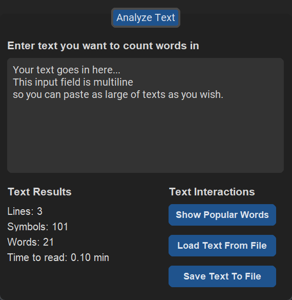

  

<h1 align="center">Word Counter App</h1>

## Table of contents

- [Table of contents](#table-of-contents)
- [About](#about)
- [Screenshots](#screenshots)
- [Links](#links)
- [License](#license)

## About

Word Counter is a simple and easy-to-use tool for analyzing texts and getting statistics about the number of words and characters they contain. It allows users to load texts from files and calculates various metrics such as word count, character count, and reading level. The app is designed to be straightforward and intuitive, making it a useful tool for writers, students, and anyone who needs to analyze texts quickly and easily.

## Screenshots

## Links

- [Icon](https://www.flaticon.com/)

## License

This project is licensed under the [Apache 2.0 License](./LICENSE).

<a href="#readme-top"><strong>Back to top</strong></a>

