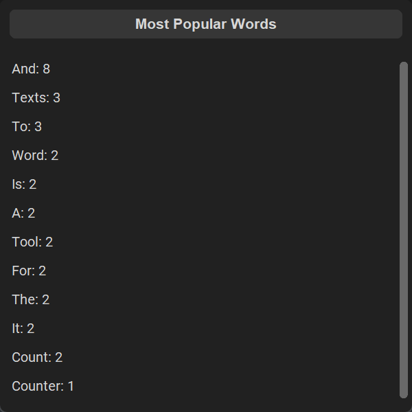

  

<h1 align="center">Лічильник слів</h1>

## Зміст

- [Зміст](#зміст)
- [Загальна інформація](#загальна-інформація)
- [Як користуватися](#як-користуватися)
- [Поради та корисна інформація](#поради-та-корисна-інформація)
- [Скріншоти](#скріншоти)
- [Посилання](#посилання)
- [Ліцензія](#ліцензія)

## Загальна інформація

Лічильник слів - це простий і зручний інструмент для аналізу текстів і отримання статистики про кількість слів і символів, що в них містяться. Він дозволяє користувачам завантажувати тексти з файлів і розраховувати різні показники, такі як кількість слів, символів і час читання. Додаток розроблений так, щоб бути простим та інтуїтивно зрозумілим, що робить його корисним інструментом для письменників, студентів та всіх, хто потребує швидкого та легкого аналізу текстів.

## Як користуватися

1. [Завантажте](https://github.com/seesmof/word-counter-app/archive/refs/tags/v1.0.0.zip) файли на ваш комп'ютер
2. Відкрийте завантажену папку і двічі клацніть файл `Run.vbs`.
3. Насолоджуйтесь!

## Поради та корисна інформація

- Натисніть клавішу Escape у будь-який момент, щоб вийти з програми
- Весь текст кодується UTF-8, тому вам не доведеться турбуватися про спеціальні символи
- Ваші дані автоматично зберігаються та завантажуються при запуску та закритті програми відповідно
- Завантажуйте власні текстові файли за допомогою кнопки `Завантажити з файлу`.
- Переглядайте найуживаніші слова за допомогою кнопки `Популярні слова`.

## Скріншоти

## Посилання

- [Іконка](https://www.flaticon.com/)

## Ліцензія

Цей проєкт поширюється за ліцензією [Apache 2.0](./LICENSE).

<a href="#readme-top"><strong>Повернутися до початку</strong></a>

